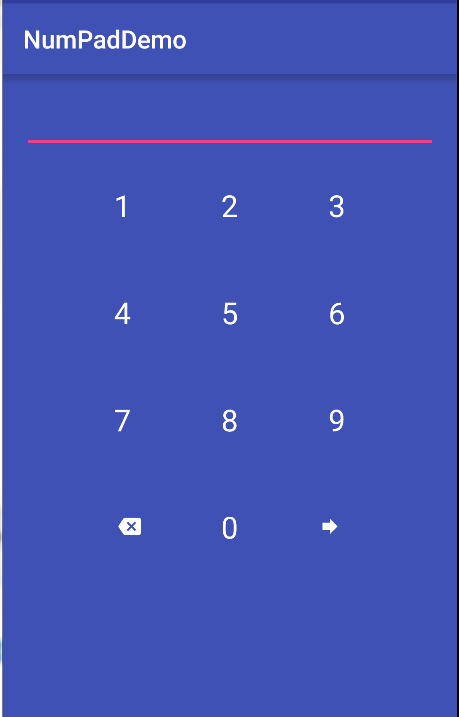

# Numpad_Keyboard_Android
A Numpad Keyboard GUI Component for android to allow entering digits like a numpad instead of soft keyboard of android.


**NOTE** :- The default color of the text and icons is **WHITE**, so it needs a color in background to be visible or change the text color using **setIconsColor()** method.

## Adding Dependencies



```

	compile 'swarajsaaj:numpad:1.0'

```

## Usage

Add following to your xml layout to insert the numpad

```

  	<swarajsaaj.numpad.Numpad
        android:id="@+id/numpad"
        android:layout_width="match_parent"
        android:layout_height="match_parent" />

```

In your Activity (or Fragment) use the following code to handle the success callbacks and changing icon colors.

```

	  @Override
    protected void onCreate(Bundle savedInstanceState) {
        super.onCreate(savedInstanceState);
        setContentView(R.layout.activity_main);
        Numpad numpad = (Numpad) findViewById(R.id.numpad);
        numpad.bindNextStepHandler(new NumpadHandler() {
            @Override
            public void nextStep() {
                Toast.makeText(MainActivity.this, "Next Task", Toast.LENGTH_SHORT).show();
            }
        });
        numpad.setIconsColor(R.color.colorPrimaryDark);
    }


```

**bindNextStepHandler(NumpadHandler handler)** takes in a NumpadHandler's implementation to override **nextStep** method which will be executed when clicked on forward button after entering the text. Here I make a toast to indicate that.

**setIconsColor(int colorId)** as indicated by the name sets the color of icons and text numbers in the numpad.